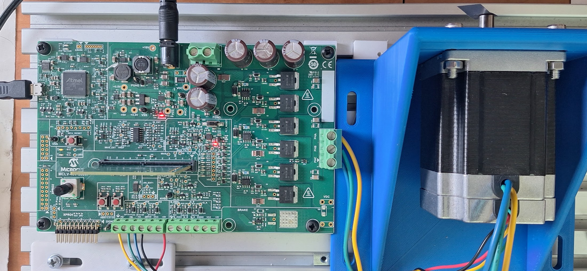

# mc_foc_sl_fip_dspic33ck_mclv48v300w_Melody

Speed mode control of ACT motor with BEMF PLL estimator.

## Getting Started

The project and the code is generated by MPLAB X MCC and X2C (Scilab model).

* Use MPLABX to open the project.
* Compile the program in MPLAb X
* Program the HW from MPLAB X (Board has PickIt On Board, see below)
* Use MCC plugin to open the Scilab model
* Use X2C communicator to modify parameters and monitor signals during runtime.

### Software
* [MPLAB X v6.20](https://www.microchip.com/mplab/mplab-x-ide)
* [XC Compilers XC16 v2.10](https://www.microchip.com/mplab/compilers)
* [Scilab v2023](https://www.scilab.org/) (Scilab 6.x is not supported yet)
* [X2C v6.5](https://x2c.lcm.at/downloads/)

Model sample rate: 0.0001

### Hardware

* MCS MCLV-48V-300W Development Board Part Number: EV18H47A
* dsPIC33CK256MP508 MC DIM Part Number: EV62P66A
* Brushless DC Motor ACT 57BLF02